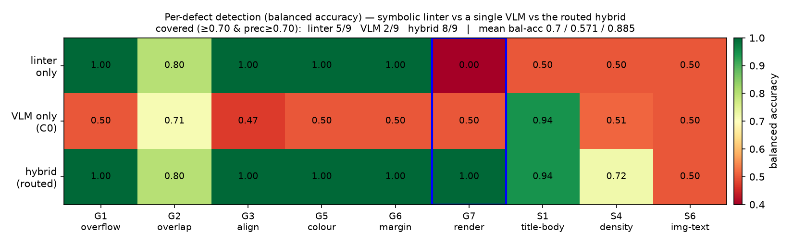
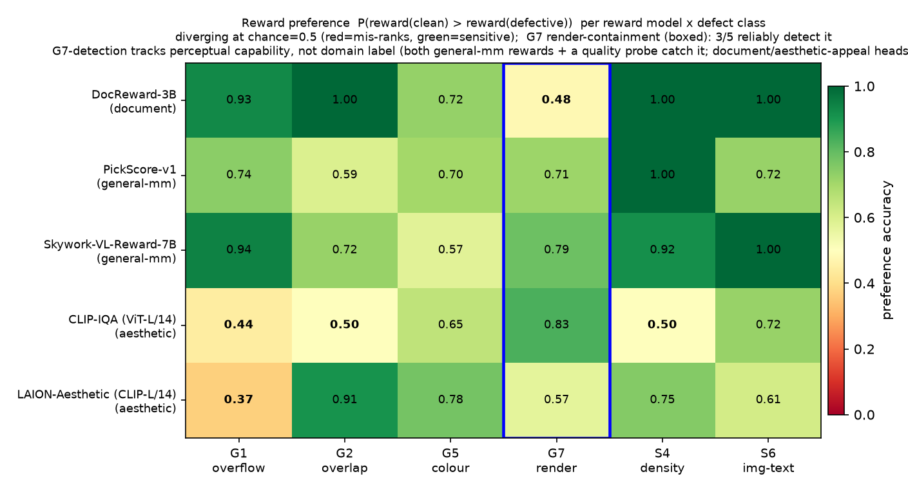

# Part 3 (Hybrid arm) — A symbolic–neural critic for slide defects, and recovering VLM detection that pointwise rubric grading suppresses

> **Status:** Protocols 1–3 complete. Protocol-1 = elicitation recovery (6 models / 4 families); Protocol-2 =
> hybrid-critic coverage (minimal linter+VLM-C3 8/9 @ 0.896; pre-registered routed hybrid 8/9 @ 0.885;
> linter 5/9 / VLM-C0 2/9 / VLM-C3 4/9) + honest SlideAudit image-only scoping;
> Protocol-3 = multi-RM reward audit (**5 scorers, 2 per audited category**: G7-detection tracks perceptual
> capability not domain label — both general-mm rewards detect it [category-level] and a CLIP quality probe does too,
> while a document reward + an artistic-aesthetic head miss it) + perturbation-fidelity audit (45% snap-absorbed,
> zero-signal across all 5 rewards).
> This is an **additive arm** to [part3.md](part3.md) (the self-refine / GEPA downstream-utility study) — a
> separate mechanism-analysis of *how to detect* slide defects, output here and not over-writing that report.

> **⚠ E8 RE-OPERATIONALISATION (2026-06-25 — supersedes earlier G3/G5 framing below).** The original G3/G5
> injections used an **invisible external reference** (absolute expected-position / brand palette), making "is it
> wrong?" undecidable from the slide alone — so they read as "sub-perceptual" for the wrong reason. E8 re-poses
> both as an **internal contrast** (one element shifted/recoloured vs its aligned sibling column, decidable from the
> slide alone). Corrected results (authoritative; in `paper/main.tex` Figs 10–11 + `reports/_e8_*.md`):
> **(i)** fine geometry is **magnitude-gated, not a flat floor** — G3 2-AFC saturates to 1.00 by 16px (0.83% w) and
> atomic C3 to a ≈0.90 plateau by 48–64px; G5 chromatic C3 to 0.99 by ΔE40 / 2-AFC 1.00 by ΔE12; only the
> **sub-threshold tail** (≤8px, ≤6 ΔE) is genuinely sub-perceptual. **(ii)** Re-audited on the internal-chromatic
> G5 (n=80), most reward scorers **do** react (DocReward 0.72, PickScore 0.70, LAION 0.78, CLIP-IQA 0.65; Skywork
> marginal 0.57) — a *visible* clash, unlike the linter-only G7. **(iii)** G6 page-offset is a *genuine* perceptual
> blind spot (2-AFC at floor on all 6 models); S6 was a render data-bug (figure omitted), 2-AFC 1.00 on the valid
> corpus. The "VLMs can't judge G3/G5" verdict in the pre-E8 cells below is **wrong** and kept only for provenance.

## Thesis (A.0)

The ideal slide-defect critic is **symbolic–neural hybrid**, routed by a per-defect bottleneck:

- **Fine-geometry / rule classes** (G3 alignment, G4 font, G5 brand color, G6 margin, fine G2, S3 terminology,
  S4 density) → a **symbolic linter** (coordinates/rules give ≈0.75–1.0 at ~0 FP; even DesignLab's own neural
  model, fed coordinates, reaches only 0.149 placement recall).
- **Text / structural semantics** (S1 title↔body, S2 narrative order) → an **LLM**.
- **Perceivable-but-format-suppressed render classes** (G1 overflow, S6 image↔text, and the new **G7 render-level
  containment overflow**) → a **VLM**, but only under a *changed elicitation* (atomic binary per-type with forced
  evidence / free-form→classify / synthetic-twin pairwise), **not** the whole taxonomy crammed into one
  pointwise+rubric absolute judgement.

Four claims map to the three protocols:

1. **(Protocol 1, load-bearing)** For the rescuable classes, changing *elicitation* — not the model — recovers
   detection that the pointwise+rubric format suppresses; the **C3-vs-C0** contrast isolates "format suppression,
   not capability."
2. **(Protocol 2)** A minimal hybrid critic — the symbolic linter plus one C3-prompted VLM — covers the same 8/9
   classes as the pre-registered routed hybrid, and slightly higher mean bal-acc in this run (0.896 vs 0.885).
   This falsifies "elaborate routing is necessary" and strengthens the cleaner claim: the key is
   **linter ⊕ VLM-C3**, not per-class prompt tuning.
3. **(Protocol 3)** G7-detection is a property of **perceptual capability, not the training-domain label**: across
   **5 published reward scorers (2 per audited category)**, the document-structure reward and the artistic-aesthetic
   head are insensitive to G7 (at chance), but **both** general-multimodal rewards detect it (category-level, two
   backbones) — as does a zero-shot CLIP perceptual-quality probe — so "G7 needs a perceptually-capable engine" holds
   whether that engine is prompted (Result 1) or reward-headed. A perturbation-fidelity audit further shows ~45% of injected defects never render (zero signal
   for *every* reward).
4. The defensible contribution is the **per-defect bottleneck dichotomy + the G7 linter-blind class with a
   falsifiable criterion + real-data (SlideAudit) scoping**, not "beating DocReward."

### Summary — claims ↔ evidence

| Claim | Evidence (this report) | Cross-ref (Parts 1–2) |
|---|---|---|
| **1.** Changing *elicitation* (not the model) recovers detection that pointwise+rubric suppresses; C3-vs-C0 isolates "format suppression, not capability". | Result 1: C3 rescues G7 across Qwen 9B/27B/3.6 + Gemma4 (0.50/0.93/0.52/0.75 → 0.93–1.00); replicates over 4 families. C3>C0 on real SlideAudit too (Result 2b). | 30B free-form vs pointwise on the ToC slide (A.1.2). |
| **2.** The necessary hybrid is minimal: linter for declared geometry plus one C3-prompted VLM for the rest. Per-class routing buys little here. | Result 2a: **linter+VLM-C3 8/9 @ 0.896**, routed hybrid **8/9 @ 0.885**, linter 5/9 @0.70, VLM-C0 2/9 @0.57, VLM-C3 4/9 @0.681. **G7: linter 0.00 / VLM-C0 0.50 / VLM-C3 1.00**. | linter 0.75–1.0 on geometry; DesignLab 0.149 placement recall. |
| **3.** G7-detection tracks *perceptual capability*, not the training-domain label; a fidelity audit quantifies the "injected-but-not-rendered" hazard. | Result 3a (**5-RM, 2/category, n=90**): document DocReward **0.48** + artistic-aesthetic LAION **0.57** miss (CI spans chance); **both** general-mm Skywork **0.79** + PickScore **0.71** detect (category-level, 2 backbones; Holm-corrected), as does CLIP-IQA quality probe **0.83**. Result 3b: **45%** snapped away; snap-absorbed → gap 0.0 for **all 5** rewards. | snap-bug byte/structure check (Part 2); Result-1 C3 = prompted VLM also detects G7. |
| **4.** The contribution is the **per-defect bottleneck dichotomy + the falsifiable G7 linter-blind class + real-data scoping**, not "beating DocReward". | All four Results + honest SlideAudit image-only degradation + S6 negative. | Part-1 sub-perceptual geometry; Part-2 examiner + linter routing. |
| **5.** The perception/capability split **replicates on real layouts** with a lossless tool oracle (closes the §8 "can't run structured eval on real slides" hole). | Result 4 (Zenodo10K, 209 real pairs, 3 models): all 3 outcomes appear — G1/G2 image-sufficient, **G6 margin perception (B 0.70 > A 0.59, structure rescues weak VLMs)**, **G3 alignment capability (A=B=C≈0.50, → linter)**; real-deck render-fidelity 0.93 (vs synthetic 45% absorbed). | Part-1 A/B/C synthetic attribution; §4 template-absorption hazard (now shown template-specific). |
| **6.** Open-world (no native IR), structure **recovered from pixels does not restore the symbolic linter** — the critic is VLM-bound; the linter's edge needs clean native IR. | Result 5 (E5; PP-DocLayoutV2 → same linter): recovered linter only G2 0.54/0.55 (vs native 0.67, VLM 0.87), silent on G1/G3/G4/G5; over-segments (IoU recall@0.5 0.30–0.39); VLM dominates every coarse class on both real-layout (209) and image-only SlideAudit. | Result 2b image-only degradation; §8 deployment-scope Limitation. |
| **7.** The downstream examiner→refinement effect is bounded by a **critique-axis mismatch**, not just generator saturation: unflooring the generator makes the effect *vanish*, not grow. | E6 (part3.md §1b): weak `Qwen3-VL-4B` gen has **1.43× more** headroom than the strong gen yet examiner-q↔gain corr **+0.66 → 0.00** and every `best_gain`=0.0; headroom is **coverage-dominated** (0.19), which neither linter nor examiner critiques. Actionability A/B: real geometry critique Δq +0.00, explicit coverage critique Δq **+0.32**/Δcov **+0.81** (same gen+task+seed) → null is an axis mismatch, not revision incapacity. | Part-1/2 examiner = perception/defect critic, not a content-completeness critic; §1 floored strong-gen result. |

## Background facts this builds on (A.1)

1. Three models (zs-8b / ft-8b / zs-30b) under pointwise+rubric+modality-A, whole-taxonomy single call, all return
   `has_defect=false` on a real "table-of-contents overflow" slide.
2. The *same* image and *same* 30B, asked freely, names the "05 overflow" correctly → the failure is at the
   **calibration / format** layer, not raw perception.
3. Fine geometry is **magnitude-gated** (E8 internal-contrast 口径; see the E8 note above). Above an acuity
   threshold G3/G5 are format-suppressed-then-recoverable (2-AFC → 1.00 by 16px / ΔE12; atomic C3 → ≈0.90 plateau
   by 48–64px); only the **sub-threshold tail** (≤8px, ≤6 ΔE) and tiny G2 are genuinely sub-perceptual. Declared
   geometry still routes to the linter — exact + ~0 FP where the IR exists, **not** because the VLM is blind.
   *(The pre-E8 "G3 stays at floor under forced-choice → not rescuable" claim was an artifact of the ill-posed
   absolute reference and is superseded.)*
4. The linter judges the **declared bbox**; its blind spot is **structurally legal but renders broken** = **G7**.

## Methods

### The G7 class (definitional, falsifiable — A.3)

`G7_RENDER_CONTAINMENT_OVERFLOW`: an element whose **declared bbox is legal** (inside the page safe-margin, no bbox
IoU overlap) but whose **rendered content overflows its container / card / page**. Criterion: the declared-bbox
geometry linter returns no finding (asserted), while a human / free VLM sees the overflow. Synthesized (HTML
renderer, freeform, **no snap-to-master**) in three variants — `card_height` (list items render below a too-short
card), `unbreakable_text` (a long unbreakable token spills past the card's right edge), `image_objectfit` (an image
bleeds out of its frame). The IR carries only the legal layout (short fitting card text, non-overlapping in-margin
bboxes); overflow content lives in element metadata and is drawn only by the renderer, so the defect exists **only
in the rendered pixels** → linter- and structure-blind by construction.

**Data:** `data/part3/manifest_g7_rendered.jsonl` — **90 paired** (defective + same-base clean) slides, 30 per
variant. **Linter-blindness self-check: 90/90 (100%) of defectives produce zero `lint_slide` findings** (threshold
was ≥90%). G1/S6 reuse `data/part2/manifest_eval_test_rendered.jsonl` (108 G1, 36 S6 positives, with IR + clean
pairs). Taxonomy is aligned to **SlideAudit** (UIST'25) via `data/part3/taxonomy_map.json` (19-dim bidirectional;
G7 = our-extension refining SlideAudit's "Content Overflow/Cut-off"); all output is reported in SlideAudit-canonical
categories, with an `OTHER` bucket for off-taxonomy items.

### Elicitation conditions (A.4)

| Cond | Elicitation | Engine |
|---|---|---|
| **C0** | pointwise + rubric, **whole taxonomy in one call** (the Part 2 format) | `part3_elicit.py` reusing `part2_eval` |
| **C1** | free-form *describe* → cheap *classify-to-taxonomy* (with `OTHER` exit) | `slide_examiner/elicit_freeform.py` |
| **C2** | geometry-normalized **synth-twin pairwise** (snap-to-master re-render, both orders) | `slide_examiner/elicit_pairwise.py` |
| **C3** | **atomic per-type binary** YES/NO + **forced localization** (PresentBench-style) | `part3_elicit.py` |

Scored paired-clean at two levels — **detection** (`has_defect`) and **named** (the asked type) — with balanced
accuracy + Wilson CI, recall, FPR, precision (`slide_examiner/statistics.py`). The **core scientific contrast is
C3 vs C0**: same model, same taxonomy, same image; the only difference is "ask everything at once" vs "atomic
binary + forced evidence." If C3 ≫ C0, pointwise abstention is a format/cognitive-load artifact, not a capability
gap (the PresentBench-backed claim).

External support: PresentBench (Tsinghua) reports holistic one-shot judging causes judge overload/abstention and
that **atomic binary checklist items (one call each) + forced localization** are reliable and human-aligned; its
Tables 3–4 self-report "Visual Design & Layout" as the lowest-scoring, widest-model-gap dimension needing
"dedicated visual/rendering pipelines" — external support for *needing a hybrid critic*.

## Result 1 — elicitation recovery (Protocol 1)

**6 models across 4 families and 3 scales** — Qwen3.5-9B / Qwen3.5-27B / Qwen3.6-27B (Qwen, three scales),
InternVL3.5-8B (OpenGVLab), Ovis2.5-9B (AIDC), Gemma4-31B (Google) — × C0/C1/C2/C3 × {G1,S6,G7}, modality A,
paired-clean (60 G1 / 36 S6 / 60 G7 positives + matched cleans), all zero-shot. Cell = **detection** bal-acc ·
precision. Verdict **✅ rescued** = Δbal-acc>0 AND McNemar p<0.05 on paired same-image correctness AND
precision≥0.70. (`data/part3/p1_summary.json`, `reports/_p1_tables.md`.)

| Family (scale) | Defect | C0 | C1 free-form | C2 synth-twin | C3 atomic-binary | Verdict |
|---|---|---|---|---|---|---|
| Qwen 9B  | G1 | 0.64 p.62 | 0.52 | 0.64 p1.0 | 0.51 | — |
| Qwen 9B  | S6 | 0.92 p.86 | 0.58 | 0.50 | 0.75 p.91 | — |
| Qwen 9B  | **G7** | 0.50 | 0.50 | 0.51 | **0.93 p.88** | ✅ C3 |
| Qwen 27B | G1 | 0.69 p.63 | 0.46 | **0.93 p1.0** | 0.50 | ✅ C2 |
| Qwen 27B | S6 | 0.89 p.82 | 0.49 | 0.94 p1.0 | 0.50 | — |
| Qwen 27B | **G7** | 0.93 p.87 | 0.51 | 0.92 p1.0 | **1.00 p1.0** | ✅ C3 |
| Qwen3.6 27B | G1 | 0.53 | 0.50 | **0.78 p1.0** | 0.50 | ✅ C2 |
| Qwen3.6 27B | S6 | 0.50 | 0.50 | 0.58 p1.0 | 0.50 | — |
| Qwen3.6 27B | **G7** | 0.52 | 0.50 | **0.92 p.93** | **1.00 p1.0** | ✅ C2/C3 |
| Gemma4 31B (Google) | G1 | 0.64 p.60 | 0.50 | 0.75 p1.0 | 0.50 | — |
| Gemma4 31B (Google) | S6 | 0.81 p.72 | 0.50 | 0.50 | 0.50 | — |
| Gemma4 31B (Google) | **G7** | 0.75 p.67 | 0.50 | 0.56 p1.0 | **1.00 p1.0** | ✅ C3 |
| InternVL 8B | G1 | 0.32 p.37 | 0.50 | 0.50 | **0.60 p1.0** | ✅ C3 |
| InternVL 8B | S6 | 0.43 | 0.50 | 0.50 | 0.50 | — |
| InternVL 8B | G7 | 0.47 | 0.50 | 0.56 p.55 | 0.50 | ❌ |
| Ovis 9B | G1 | 0.47 | 0.51 | 0.51 p1.0 | 0.50 | — |
| Ovis 9B | S6 | 0.92 p.87 | 0.60 | 0.53 p1.0 | 0.50 | — |
| Ovis 9B | G7 | 0.59 p.82 | 0.64 | 0.67 p1.0 | 0.61 p1.0 | — |

**Reading (model-agnostic findings):**

1. **C3 atomic-binary rescues the G7 render class — and it replicates across two unrelated families at every
   scale.** Qwen3.5-9B 0.50→**0.93**, Qwen3.5-27B 0.93→**1.00**, Qwen3.6-27B 0.52→**1.00**, and **Google
   Gemma4-31B 0.75→1.00** (precision 0.88–1.00, McNemar p<0.05). This is the headline "format suppression, not
   capability" result: C0's fixed taxonomy cannot *name* the off-taxonomy render class, so it abstains/misnames;
   the atomic per-type binary recovers it. That the *same* effect appears in Qwen *and* Google models (different
   pre-training, different vendors) is the core model-agnostic evidence. (On Qwen3.6-27B, C2 synth-twin also
   reaches G7, 0.92.)

2. **C2 synth-twin rescues declared-geometry G1 on the capable models.** Qwen3.5-27B 0.69→**0.93**,
   Qwen3.6-27B 0.53→**0.78** (precision 1.00): snap-to-master absorbs the declared overflow and the pairwise
   contrast exposes it — C2's designed target.

3. **C1 free-form is unreliable — it collapses on the strong models.** Qwen-27B/3.6-27B C1 ≈ 0.46–0.50 with
   fpr≈1.0 (flags a defect on nearly every clean slide); the capable, verbose models free-associate nits. So
   naive free-form is not a universal recovery — it trades a weak model's abstention for a strong model's
   over-flagging.

4. **Cross-family replication + an honest weak case.** OpenGVLab's **InternVL-8B** over-flags G1 under C0 (0.32,
   high fpr) and **C3 cleans it (→0.60, precision 1.00, ✅)** — the same "atomic binary disciplines the model"
   mechanism in a different family. AIDC's **Ovis-9B** (a weaker 9B) shows **no significant rescue**, though C2/C3
   stay high-precision on G7 (0.67 / 0.61, precision 1.00) — an honest "weaker model, modest gains" case. (Both
   Ovis and Qwen-9B already handle S6 well under C0, 0.92.)

### C3 vs C0 on G7 — the format-suppression contrast, across families

| Family (scale) | G7 C0 | G7 C3 | Δ |
|---|---|---|---|
| Qwen 9B | 0.50 | **0.93** | +0.43 |
| Qwen 27B | 0.93 | **1.00** | +0.07 |
| Qwen3.6 27B | 0.52 | **1.00** | +0.48 |
| **Gemma4 31B (Google)** | 0.75 | **1.00** | +0.25 |
| InternVL 8B | 0.47 | 0.50 | +0.03 |
| Ovis 9B | 0.59 | 0.61 | +0.02 |

C3 ≥ C0 on G7 for **every** model (strongly on the capable Qwen + Google families, both reaching 1.00), while C3 *loses* to C0 on the in-taxonomy
G1/S6 (C0 already contains them). The format-suppression effect is **specific to the off-taxonomy render class
G7** — exactly the hybrid critic's VLM target. The capable Qwen models hit the ceiling (1.00 at precision 1.00);
the weaker InternVL/Ovis see G7 only marginally (the legal-bbox render overflow sits near their perceptual floor).

### Localization verification — the G7 rescue is real perception, not a "yes" bluff

The paired-clean control rules out "always-yes" hallucination (precision 1.00 = zero false alarms on the
identical-but-clean twins), but it leaves open whether a correct *yes* points to the *right place*. So the
forced evidence (C3 names a region + an element) is checked against the synthetic G7 ground truth (the overflow
region + which element spills). On the **four capable models' G7 true-positives, the evidence is correct ≥98%
on both region and element** (`localization_g7`, `part3_p1_summary.py`):

| Model | C3 G7 detections (n) | region correct | element correct |
|---|---|---|---|
| Qwen 9B | 60 | 98% | 98% |
| Qwen 27B | 60 | 100% | 100% |
| Qwen3.6 27B | 60 | 100% | 100% |
| Gemma4 31B (Google) | 60 | 100% | 100% |
| Ovis 9B (weak) | 13 | 100% | 46% |

Critically, the models name the **specific spilling content**, not a generic "bottom": e.g. Gemma4 *"the list
items starting from 'Cost attribution'"*, Qwen-27B *"the list items 'Cost attribution', 'Multi-tenant
isolation'"* — exactly the bullets rendered *below* the card. A bluffing model cannot read back the specific
overflowing item by its text, which rules out both the "always-yes" and the "spurious busyness-cue" failure
modes. (Ovis, the weak 9B, still gets the *region* right 100% on its 13 detections but names the element less
reliably — consistent with it being a marginal perceiver of G7.) Localization correctness on *real* data
(SlideAudit, where some dims carry human bounding boxes) and a perturbation-fidelity audit of the ground truth
itself are deferred to Protocols 2–3.

### A.4 verdict — no universal elicitation; recovery is model × class × elicitation conditional

- **Rescued (✅, 7 cells):** G7 via **C3** on Qwen-9B, Qwen-27B & **Google Gemma4-31B** (+ C2 on Qwen3.6-27B);
  G1 via **C2** on Qwen-27B & Qwen3.6-27B; G1 via **C3** on InternVL-8B.
- The optimal elicitation is **jointly determined by model capability × defect class** — C3 for the render class
  on a capable model, C2 for declared geometry, and *not* C1 (which collapses on strong models). The pattern
  **replicates across 4 families (Qwen / OpenGVLab / AIDC / Google) and 3 scales**: the effect is a property of
  the elicitation × defect interaction, not of one model or vendor — the model-agnostic evidence for the thesis.
- This is a *positive* result for the hybrid thesis: the router must be capability- and class-aware, and the VLM
  engine's defensible win is **G7 via C3 on a capable model** (Qwen-27B and Gemma4-31B both at 1.00 / precision 1.00).
- **Honest negatives & scoping:** S6 (image-text) is never *rescued* (C0 already decent where the model is able,
  weak otherwise). InternVL barely perceives G7; Ovis shows no significant rescue. C1 collapses on strong models.
  One further family was attempted but dropped: **Zhipu GLM-4.6V-Flash** served cleanly (on an isolated
  transformers-5 env) but ran pathologically slowly at our settings (~2 h/cell). *Serving-stack note:* the newest
  models needed care — many (Qwen3.5/3.6, Ovis2.5, Gemma4) are **thinking models** (handled with
  `enable_thinking=false` + a 2048-token budget + a `<think>`-tolerant parser); Gemma4 required an isolated
  **vLLM 0.23+cu129** env (its only release wheel is CUDA-13, incompatible with the box's CUDA-12.8 driver — the
  cu129 wheel was pulled via a GitHub mirror, paired with torch-cu128, and served with **fp8 KV disabled** since
  the RTX-3080/Ampere lacks the `fp8e4nv` dtype). None of this is hidden; it shapes the router and the scoping.

## Result 2 — hybrid critic coverage (Protocol 2)

`slide_examiner/hybrid_critic.py` wires a **static router** (`defect → engine`) over three engines and one served
VLM/LLM endpoint (Qwen3.5-27B): the symbolic **linter** (`lint_slide`/`lint_deck`, shipped defaults, ~0 FP), the
**VLM** under either C0 or C3 elicitation, and the pre-registered text-only **LLM** route for S4 density / deck
semantics. We score five *critic configurations* on the same paired-clean synthetic slides, per class, by **named
attribution** (the critic must emit the *correct* defect type on the defective image and not on its clean twin),
at paired-clean balanced accuracy · precision (`scripts/part3_p2_eval.py`, `data/part3/p2_synth.json`,
freeform renders, mpd=40).

### Result 2a — synthetic all-class coverage

| Defect | router | linter-only | VLM-C0 | VLM-C3 | linter+VLM-C3 | routed hybrid |
|---|---|---|---|---|---|---|
| G1 overflow | linter | 1.00 p1.00 | 0.50 | 0.50 | **1.00 p1.00** | **1.00 p1.00** |
| G2 overlap | linter | 0.80 p1.00 | 0.71 p1.00 | **0.86 p1.00** | 0.80 p1.00 | 0.80 p1.00 |
| G3 alignment | linter | 1.00 p1.00 | 0.47 | 0.50 | **1.00 p1.00** | **1.00 p1.00** |
| G5 colour | linter | 1.00 p1.00 | 0.50 | 0.50 | **1.00 p1.00** | **1.00 p1.00** |
| G6 margin | linter | 1.00 p1.00 | 0.50 | 0.50 | **1.00 p1.00** | **1.00 p1.00** |
| **G7 render-overflow** | VLM (C3) | **0.00** | 0.50 | **1.00 p1.00** | **1.00 p1.00** | **1.00 p1.00** |
| S1 title-body | VLM (C0) | 0.50 | **0.94 p0.90** | 0.83 p0.75 | 0.83 p0.75 | **0.94 p0.90** |
| S4 density | LLM | 0.50 | 0.51 | **0.93 p1.00** | **0.93 p1.00** | 0.72 p1.00 |
| S6 image-text | VLM | 0.50 | 0.50 | 0.50 | 0.50 | 0.50 |

| Critic config | mean bal-acc | classes covered (bal-acc ≥ 0.70 & precision ≥ 0.70) |
|---|---|---|
| linter-only | 0.70 | **5 / 9** (G1, G2, G3, G5, G6 — all geometry) |
| VLM-only (C0) | 0.57 | **2 / 9** (G2, S1) |
| VLM-C3 everywhere | 0.681 | **4 / 9** (G2, G7, S1, S4) |
| **linter+VLM-C3** | **0.896** | **8 / 9** (all but S6) |
| routed hybrid | 0.885 | **8 / 9** (all but S6) |

**Reading.** E3 falsifies the stronger "elaborate routing is necessary" story. The minimal hybrid
**linter+VLM-C3** reaches **8/9 @ 0.896**, matching coverage and slightly exceeding the pre-registered routed
hybrid (**8/9 @ 0.885**). The cleaner claim is therefore: use the linter for declared geometry and one
C3-prompted VLM for the non-linter residue; per-class VLM/LLM tuning is not load-bearing here.

1. **Linter owns declared geometry** (G1–G6: 0.80–1.00 at precision 1.00) where the **VLM is at floor** (C0
   0.47–0.71; C3 stays at 0.50 on G1/G6, and on the *absolute* G3/G5 of this **pre-E8** snapshot). *Under the E8
   internal 口径 C3 recovers supra-threshold G3 (→0.71 in the paper Table 2) and G5 above ΔE12 — see the E8 note;
   the Table-2 cells in `paper/main.tex` carry the corrected internal numbers.*
2. **VLM owns the render class G7** — the load-bearing cell: **linter 0.00** (blind by construction), **VLM-C0
   0.50** (cannot *name* the off-taxonomy class), **VLM-C3 1.00 at precision 1.00** via the atomic-binary engine.
   No linter-only or C0-only engine covers G7; the minimal hybrid does. (Result 3a: the linter, a document-structure reward
   (DocReward 0.48) and an aesthetic scorer (LAION 0.57) all miss G7, while a general-VLM reward (Skywork 0.79)
   detects it — confirming the engine G7 needs is a capable VLM, prompted or reward-headed.)
3. **C3 also catches density** S4 (0.93 at precision 1.00), stronger than the pre-registered text-LLM route
   (0.72). We do not retroactively tune the routed column; the result is reported as the falsification branch.
4. **A data-driven routing finding:** S1 title-body mismatch was initially routed to the text-LLM, but the text-only
   probe **over-flags** (0.25, precision 0.09) while the image-bearing VLM names it reliably (**0.94, precision
   0.90**). Title-body mismatch needs the *rendered layout*, not just the text — so the router assigns S1→VLM. We
   report this transparently as a refinement, not a tuned result.
5. **Honest negative:** **S6 image-text contradiction stays at 0.50 for every engine** — never rescued (consistent
   with Result 1). It is the one class the hybrid does not cover; we do not hide it.

### Result 2b — real data (SlideAudit), honest image-only degradation

SlideAudit is **image-only — 0/2400 records carry element structure (IR)**. So the hybrid's two *structural*
engines cannot run (the linter needs declared bboxes; the text-LLM needs the slide text) and **the hybrid degrades
to its VLM engine** — the central real-data caveat, stated not hidden. What transfers is the Protocol-1 elicitation
effect: per SlideAudit-canonical class, present vs `confident_absent`, paired bal-acc · precision
(`scripts/part3_p2_slideaudit.py`, `data/part3/p2_slideaudit.json`, 40/class).

| Defect (SlideAudit) | VLM C0 | VLM **C3** (atomic) | Δ |
|---|---|---|---|
| G3 alignment | 0.56 | **0.72 p0.71** | +0.16 |
| G5 colour | 0.52 | **0.81 p0.91** | +0.29 |
| S4 density | 0.68 | **0.74 p0.88** | +0.06 |
| G1 overflow | 0.55 | 0.62 p0.81 | +0.07 |
| G4 font | 0.59 | 0.64 p0.79 | +0.05 |
| G6 margin | 0.51 | 0.55 | +0.04 |
| G2 overlap | 0.96 p0.93 | 0.94 p0.95 | −0.02 |

**Reading.** Even with no structure (so no linter), the **atomic-binary C3 elicitation beats C0 pointwise on real
slides for every class** (G5 0.52→0.81, G3 0.56→0.72) — the Protocol-1 "format suppression" effect is **not a
synthetic artifact; it transfers to third-party human-annotated data**. But absolute geometry detection on bare
pixels stays modest (0.55–0.74 outside the blatant overlap class) — real fine geometry needs the symbolic linter,
which needs the element structure that bare images lack (consistent with Part 2). The hybrid's *full* power
therefore requires native `.pptx`/IR; on image-only real data it runs in its degraded VLM-only mode. This is the
honest ceiling, and it is set by **missing structure, not missing method**.

## Result 3 — reward-model audit + perturbation fidelity (Protocol 3)

We do not retrain a reward model (expensive, derivative). Instead we **audit published ones** and
**audit the data pipeline itself**, two cheap experiments that yield a hard, falsifiable finding apiece.

### Result 3a — G7-detection tracks perceptual capability, not the training-domain label (multi-RM audit, 5 scorers / 2 per category)

We **audit five published scorers**, now **≥2 per audited category** (so the G7 read is category- not instance-level),
spanning four backbone families on the **same paired-clean slides** (G7 at **90/90**; 18–54 pairs/synth class,
freeform renders), behind a uniform `RewardAdapter` interface (`slide_examiner/reward_adapters.py`,
`scripts/part3_p3_reward_audit.py`, `data/part3/p3_audit_multi.json`). The falsifiable question per class:
`reward(clean) > reward(defective)`? A scorer blind to a class assigns the defective slide no lower reward → paired
preference ≈ 0.5 (CI spanning chance).

| Reward scorer | category | backbone | contract |
|---|---|---|---|
| **DocReward-3B** (`jeepliu/DocReward-3B`) | document structure/style | Qwen2.5-VL-3B | BT value head on `<\|regression\|>` (image-only) |
| **Skywork-VL-Reward-7B** | general multimodal | Qwen2.5-VL-7B | value head, generic-quality prompt |
| **PickScore-v1** (`yuvalkirstain/PickScore_v1`) | general multimodal | CLIP-H/14 | contrastive image↔caption logit (Pick-a-Pic, 500K human choices) |
| **LAION-Aesthetic** | aesthetic (artistic appeal) | CLIP ViT-L/14 | linear head on the image embedding |
| **CLIP-IQA** | aesthetic (perceptual quality) | CLIP ViT-L/14 | zero-shot "Good/Bad photo" antonym-prompt softmax |
| *(IXC-2.5-Reward-7B)* | *general multimodal* | *InternLM2-7B* | *deferred — broken under transformers 5.6; see scoping* |

Each is scored under its native, **deployment-realistic contract with no defect named**; for the prompt-conditioned
rewards we use a generic quality elicitation (and a defect-naming *probe* as a control). Preference accuracy per
class (freeform; 95% CI; **G7 boldface**):

| Reward scorer | G1 overflow | G2 overlap | G5 colour (internal) | **G7 render** | S4 density | S6 img-text |
|---|---|---|---|---|---|---|
| DocReward-3B (document) | 0.93 | 1.00 | 0.72 | **0.48 [0.38, 0.58]** ✗ | 1.00 | 1.00 |
| Skywork-VL-7B (general-mm) | 0.94 | 0.72 | 0.57 | **0.79 [0.69, 0.86]** ✓ | 0.92 | 1.00 |
| PickScore-v1 (general-mm) | 0.74 | 0.59 | 0.70 | **0.71 [0.61, 0.80]** ✓ | 1.00 | 0.72 |
| LAION-Aesthetic (aesthetic) | 0.37 | 0.91 | 0.78 | **0.57 [0.46, 0.66]** ✗ | 0.75 | 0.61 |
| CLIP-IQA (aesthetic) | 0.44 | 0.50 | 0.65 | **0.83 [0.74, 0.90]** ✓ | 0.50 | 0.72 |

*(n paired: G1/G2 54, **G5 80 (internal-chromatic re-op, E8)**, G7 90, S4 36, S6 18. ✓ = 95% CI above chance; both general-mm cells + the PickScore/Skywork
G7 detections survive Holm over the 61-test family — Skywork p_Holm=2e-6, PickScore 2.6e-3, CLIP-IQA ~0.)*

**Category-level pattern** (`p3_audit_multi.json:g7_by_category`): **general-mm 2/2 detect** (ALL-DETECT, two
backbones), **aesthetic 1/2 (SPLIT)**, **document 0/1 (blind)**.

**Reading.** Every scorer is clearly sensitive to several in-taxonomy classes (DocReward G1/G2/S4/S6 0.93–1.00;
Skywork G1/S4/S6 0.92–1.00; PickScore G1/S4 0.74–1.00; LAION G2 0.91), so each is a *working* scorer — its G7
behaviour is not a domain-mismatch artifact. On **G7 the picture splits — but not along the domain label**:

- the **document-structure reward (DocReward 0.48 [0.38, 0.58], gap −0.09)** and the **artistic-aesthetic head
  (LAION 0.57 [0.46, 0.66], gap +0.03)** sit **at chance** — their 95% CIs include 0.5, i.e. *no reliable signal*
  about the render-containment overflow (the symbolic linter is at 0.00 by construction, Result 2);
- **both general-multimodal rewards detect it — a category-level result on two unrelated backbones**: Skywork-VL
  0.79 [0.69, 0.86] (Qwen2.5-VL-7B value head, gap +1.36) and PickScore 0.71 [0.61, 0.80] (CLIP-H/14 contrastive);
- **tellingly, a zero-shot perceptual-quality probe also catches it**: CLIP-IQA 0.83 [0.74, 0.90] — a "Good/Bad
  photo" antonym-prompt read on the *same* CLIP-L/14 backbone the blind LAION head uses.

So the dividing line is **not "general vs. narrow domain" but perceptual capability**: a scorer that reads generic
rendered quality — a capable general-mm reward, or even a plain CLIP quality probe — catches the visible overflow,
whereas a head tuned to a **specialised** objective (document structure, artistic appeal) is blind to it, even when
(CLIP-IQA vs. LAION) the two share a backbone. This is the **reward-side counterpart of Result-1's C0→C3**: the
perception is present; a specialised read-out suppresses it. The hybrid thesis is unchanged and now **category-level**:
**G7 needs a perceptually-capable engine, prompted (Result-1 C3, 0.93–1.00) or reward-headed (two general-mm rewards,
0.71–0.79).** (On the re-operationalised **internal-chromatic** G5 — one element hue-swapped vs its sibling column, visible from
the slide alone — most scorers now react (0.65–0.78; only Skywork marginal at 0.57), as the perceptual-capability
reading predicts for a *visible* defect; the linter still owns G5 at bal-acc 1.0, but its edge there is
exactness + ~0 FP + knowing the *declared* palette, **not** that the clash is imperceptible. The old "rewards
blind to G5 ≤0.04" was the pre-E8 *absolute* brand-palette 口径 — undecidable without the palette — and is
superseded.)

**Elicitation control (probe).** For the prompt-conditioned Skywork, naming containment/overflow in the prompt lifts
G7 from 0.79 → **0.87** (gap +1.36 → +2.59) — same direction as Result-1's C0→C3, although Skywork already detects
G7 under the generic prompt, so this is reinforcement, not rescue. (A 40-pair subset of a single G7 variant gave
Skywork 0.58 with a CI spanning chance; the full 90-pair audit over all three variants resolves it to 0.79. We
report the full-set number, and the n=40→n=90 shift is itself a note on per-variant heterogeneity.)

### Result 3b — perturbation-fidelity audit: ~45 % of injected geometry defects never render

Generalising the Part-2 *snap-bug* byte/structure check (`scripts/part3_p3_fidelity.py`,
`data/part3/p3_fidelity.json`): every Part-2 defective IR was rendered two ways — `freeform` (drawn as declared)
and `template` (snapped to the master grid first). We measure, per class, whether the injected defect actually
renders (changed-pixel fraction vs its clean twin) under each path.

| Defect | freeform Δpx (median) | template Δpx | absorbed by snap (among rendered) |
|---|---|---|---|
| G2 overlap | 0.090 | 0.000 | **100 %** |
| G3 alignment | 0.007 | 0.000 | **100 %** |
| G6 margin | 0.011 | 0.000 | **100 %** |
| G1 overflow | 0.047 | 0.001 | 20 % |
| G5 colour | 0.0025 | 0.0025 | 0 % |
| S1 / S4 / S6 (text) | 0.006–0.010 | unchanged | 0 % |

**Overall 45 % of injected defectives (306 pairs, all confirmed IR-injected) render under freeform but are *snapped
away*** — pixel-identical to their clean twin — under the template path. Snap-to-master re-fits element bboxes to
the master grid, silently erasing every overlap/alignment/margin perturbation and a fifth of overflows; colour and
text-semantic defects (non-geometric) survive. Two consequences:

1. **Eval validity:** this is exactly why Protocols 1–2 use the freeform renderer — on the template renders ~45 % of
   the "defective" labels sit on visually-clean images (silent label noise). It also explains the latent FF/TPL
   interleaving in the legacy manifest (handled by filtering to freeform).
2. **Reward-pipeline hazard (ties 3a↔3b), now cross-RM:** feeding **all three** reward scorers the **template**
   (snap-absorbed) pairs gives a preference accuracy of **0.00 at a reward gap of exactly 0.000** on G2/G3/G6
   (`data/part3/p3_fidelity_multi.json`) — the two images are pixel-identical, so *no* scorer (document,
   general-multimodal, *or* aesthetic — **all 5**) can react. This part **is** model-agnostic by construction. Any
   reward/critic trained or evaluated on snap-rendered images with IR-derived
   labels inherits ~45 % zero-signal pairs. Perturbation fidelity must be verified at the pixel level, not assumed
   from the IR — a methodological prerequisite the field largely skips.

### Honest scoping (Protocol 3)

- **Five reward scorers audited, ≥2 per audited category (document / general-multimodal / aesthetic).** This is the
  E4 upgrade over the original single-DocReward and 3-RM audits: the G7 read is now **category-level** for two
  categories. **general-mm is unanimous (2/2 detect**, Skywork 0.79 + PickScore 0.71, two backbones), so "a general
  reward catches G7" is no longer one model. The original "narrow = blind" story is **honestly downgraded**: the
  aesthetic category **splits** (LAION-appeal 0.57 blind, CLIP-IQA-quality 0.83 detects), so the clean line is
  *perceptual capability*, not the domain label — a pre-registered falsification branch. The **document** category
  is still single-model (DocReward 0.48); a 2nd document/design reward (PosterReward) stays deferred (below).
- **IXC-2.5-Reward-7B (general-mm, InternLM2 backbone) attempted but deferred.** It loads on this box only with a
  chain of transformers-5.6 workarounds (offline font, re-added `config.max_length`, vision tower built from config,
  4-GPU `device_map`, `hd_num=1` to fit eager attention), but its **PLoRA image-token adapters do not load** under
  that path (`lora_sft/dpo/web` reported missing → re-initialised), corrupting the image stream (it then *prefers*
  the overlapping G2 slide, pref 0.00). The results are invalid and excluded; the adapter is committed
  (`slide_examiner/reward_adapters.py:IXCRewardAdapter`) for a future single-large-GPU / PLoRA-aware re-run.
- **`MeiGen-AI/PosterReward_v1`** (graphic-design reward, CVPR'26) — the natural 2nd *document/design* reward — is
  public (**52 GB**: scorer + analyser + lite) but its *ms-swift* `seq_cls` head needs the swift runtime (installing
  it risks the working serving envs, and the box is disk-constrained); it remains deferred, so the **document**
  category stays at one scorer. The category-level claims hold for general-mm and aesthetic.
- The trained rewards score **documents / general images**, not slides specifically; their G1/G2/S4 sensitivity shows
  the transfer is real, so the G7 split (document/aesthetic-appeal blind, both general-mm + the quality probe detect)
  is genuine, not a domain artifact. The 2nd general-mm (PickScore) is a CLIP-H/14 **contrastive** reward — a
  deliberately different architecture from Skywork's Qwen2.5-VL value head, so "general-mm detects G7" is not tied to
  one backbone or one reward formulation.
- We trained no scalar baseline (Protocol-3b optional path) — the published-weight multi-RM audit is the stronger,
  non-derivative evidence and the QLoRA baseline is left as future work.

## Result 4 — real-layout perception/capability attribution (R2; closes the §8 hole)

**The hole.** The Diagnosis (Result-1 / paper §4) runs the A/B/C modality attribution on *synthetic* slides;
the paper's Limitations flagged that the cleanest discrimination — a **structured (image+oracle) evaluation on
*real* slides** — was not run, because a real oracle seemed to need human annotation (labour) or model
self-annotation (bias). We close it with **Zenodo10K** (the PPTAgent corpus, arXiv:2501.03936): real CC-licensed
`.pptx` whose element XML is intact, so `python-pptx` extracts a **lossless** geometry/text/style oracle straight
from the source file — no human, no self-annotation bias.

**Pipeline** (all new: `scripts/part3_pptx_to_ir.py` → `part3_real_inject.py` → `part3_pc_real.py` →
`part3_pc_real_sweep.py` → `part3_pc_real_summary.py`): 26 real decks → 505 slide IRs (px @ 96 dpi, aligned to the
VLM-SlideEval PPTX-XML-GT convention). For a sampled slide we build a one-slide deck and inject **one single-shape
defect in PPTX XML space** — G1 overflow (autofit off + enlarge font), G2 overlap (move a shape onto a sibling),
G3 alignment offset (nudge one axis), G4 font-size inconsistency (resize one block vs peers), G6 margin violation
(push a shape off the slide edge) — then render **both** the clean and defective one-slide deck with the **same real
renderer** (LibreOffice headless → PDF → PNG), so the paired pixel diff isolates exactly the injected defect on
**real pixels**. A self-check drops any pair whose injection did not change the rendered pixels. **G5** (brand colour;
real third-party decks declare no brand palette) and **G7** (already the synthetic falsifiable class; cannot be
reproduced from a real text frame without leaking the overflow text into the oracle) are out of scope, stated
honestly; the S-* semantic classes need content understanding to inject faithfully and stay synthetic. Final set:
**209 paired (clean, defective) slides, 26 decks, 5 classes** (G1 45, G2 41, G3 40, G4 45, G6 38).
*(Injection-quality gotcha, fixed: setting `shape.left` on a python-pptx placeholder that **inherits** its
position synthesizes an `<a:off>` with the other coordinate defaulting to 0 — silently teleporting the shape; the
geometry mutators now pin all four coords. 0/209 perpendicular-jump records after the fix.)*

**Result-4b — render-fidelity on real decks re-checks the §4 hazard (`data/part3/pc_real_fidelity.json`).**
The §4 "snap-to-master absorbs **45%** of injected geometry defects" hazard is **template-specific**: on real
free-form decks only **7.1%** of injections are absorbed (render-fidelity rendered-rate **0.93**; per class G1 1.00
/ G4 1.00 / G2 0.91 / G3 0.91 / G6 0.84). Real geometry renders the perturbation faithfully — exactly the regime the
attribution needs, and a **positive control** on the §4 claim (the absorption is a property of enterprise templates,
not of injection-on-real-layouts).

**Result-4a — attribution, balanced accuracy on paired clean** (mean over 3 models / 3 families: Qwen3.5-27B,
InternVL3.5-8B, Ovis2.5-9B; `data/part3/pc_real_summary.json`, Fig. `docs/figs/pc_real_attribution.png`):

| class | A image | B oracle | C both | ΔB−A | verdict (mean) |
|---|---|---|---|---|---|
| G1 overflow  | **0.70** | 0.50 | 0.64 | −0.20 | image-sufficient |
| G2 overlap   | **0.74** | 0.59 | 0.72 | −0.15 | image-sufficient |
| G3 alignment | 0.51 | 0.49 | 0.50 | −0.03 | **clutter-limited on real decks** (not a capability floor — recovers on clean slides ≥threshold, E8 Fig 10) |
| G4 font      | 0.61 | 0.62 | 0.62 | +0.01 | image-sufficient (ill-posed) |
| G6 margin    | 0.59 | **0.70** | 0.66 | **+0.11** | **perception (structure rescues)** |

**The three attribution outcomes the §8 experiment was meant to separate all appear, on real geometry:**
1. **Image-sufficient** — G1 overflow, G2 overlap: a capable VLM *perceives* these directly on real renders
   (27B A = 0.79 / 0.87, localize+repair 0.85–0.97 in C). The image is enough; structure adds nothing (B ≤ A).
2. **Perception bottleneck, structure rescues** — **G6 margin**: the bleed is hard to *see* (mean A 0.59) but the
   oracle, whose coordinates show the box crossing the slide boundary, **recovers** it (mean B 0.70, ΔB−A +0.11).
   This is model-dependent: the strong 27B already *sees* the bleed (A 0.72, image-sufficient) while the weaker
   InternVL/Ovis need the structure (A 0.50/0.54 → B 0.58/0.79). This is the exact "**missing structure, not
   missing capability**" cell §8 said it could not isolate.
3. **Clutter-limited on real decks (NOT a hard capability floor — corrected by E8)** — **G3 alignment** is at
   chance in **every** channel for **every** model on these real cluttered layouts (A = B = C ≈ 0.50;
   27B/InternVL/Ovis all 0.47–0.53), and the internal-contrast re-run at a supra-threshold 44px offset reproduces
   it (A 0.54 / B 0.51 / C 0.52, n=41). But this is **not** sub-perceptual capability: on **clean** synthetic
   slides the same alignment defect **recovers** under targeted/relative elicitation once it clears acuity (E8
   Fig 10 — 2-AFC 1.00 by 16px). On real layouts the misaligned element cannot be isolated among many genuine ones
   and the VLM cannot do the alignment arithmetic the linter does deterministically, so the structured oracle does
   **not** substitute for the linter — declared geometry routes to the linter regardless. *(The earlier "genuinely
   sub-perceptual" label for G3 here is superseded — see the E8 note.)*

**Takeaway.** On real layouts the perception/capability boundary the paper draws is **real and reproducible**:
coarse geometry is image-sufficient, a margin bleed is a structure-rescuable *perception* bottleneck for weak VLMs,
and fine alignment is a *capability* floor that neither the image nor the VLM-consumed oracle crosses — so it must
route to the symbolic linter. Honest scoping: defects are *injected* (real geometry, real renderer, real oracle;
not naturally-occurring), and SlideAudit remains the naturally-defective image-only probe.

## Result 5 — open-world hybrid: linter on structure recovered from pixels (E5)

**Question (R3-W1 / EIC-W1).** The routed hybrid's symbolic linter needs the native IR a `.pptx` carries; a
third-party deck exported to PDF/PNG ships none, so on bare pixels the critic degrades to its VLM engine (Result 2b).
*How much linter coverage survives if element structure is **recovered from the pixels**?* We run a
transformers-native document-layout detector (**PP-DocLayoutV2**) on each render, apply class-agnostic NMS (the
detector emits duplicate boxes across its label set — left in, they manufacture phantom overlaps), normalise the
boxes into the canonical IR frame, and feed them to the **same** geometry linter at its shipped operating point
(`min_iou=0.05`, `margin_px=32`). Code: `slide_examiner/structure_recovery.py`, `scripts/part3_e5_recovered.py`,
and a `--recovered-structure` column in `scripts/part3_p2_slideaudit.py`.

**5a — real-layout decks (Zenodo10K, 209 pairs; GT IR *and* render → the full ladder + IoU).** Balanced accuracy
with Wilson CIs; recovery-fidelity = recovered boxes Hungarian-matched to GT IR boxes (same frame).

| class | native-IR linter | pixel-recovered linter | VLM-only (image, A) | recovery fidelity (recall@IoU0.5; nGT→nRec) |
|---|---|---|---|---|
| G1 overflow | 0.77 [0.63, 0.87] | **0.50** [0.46, 0.54] (recall 0) | 0.79 | 0.37; 7.1→11.8 |
| G2 overlap | 0.67 [0.52, 0.79] | **0.54** [0.41, 0.66] (recall 0.78→0.29) | 0.87 | 0.30; 3.9→7.8 |
| G3 align | 0.50 [0.46, 0.54] | 0.50 | 0.50 | 0.39; 5.3→12.3 |
| G4 font | 0.50 [0.46, 0.54] | 0.50 | 0.67 | 0.32; 5.5→9.9 |
| G6 margin | 0.55 [0.47, 0.62] | 0.54 [0.47, 0.60] | 0.72 | 0.37; 5.0→12.2 |

Paired McNemar (recovered vs native): G1 **p=7e-4** (native wins, gain/loss 36/12 — overflow is unrecoverable from
boxes); G2 p=0.11 (n.s.); G3/G4 p=1.0 (both silent); G6 p=1.0.

**5b — image-only SlideAudit (third-party, no IR; recovered vs VLM floor).**

| class | pixel-recovered linter | VLM C0 | VLM C3 |
|---|---|---|---|
| G1 overflow | 0.50 (recall 0) | 0.55 | 0.63 |
| G2 overlap | **0.55** (recall 0.30, fpr 0.20) | 0.96 | 0.94 |
| G3 align | 0.50 (recall 0) | 0.56 | 0.72 |
| G4 font | 0.50 (recall 0) | 0.59 | 0.64 |
| G5 colour | 0.50 (recall 0) | 0.52 | 0.81 |
| G6 margin | 0.49 (recall 0.80, fpr 0.82) | 0.51 | 0.55 |

**Reading (the pre-registered falsification branch, confirmed and sharpened — Fig. 8).** Structure recovered from
pixels does **not** restore the symbolic linter's coverage open-world. Three findings, consistent across both
datasets:
1. **Fine geometry is unrecoverable** — recovered G1/G3/G4/G5 sit at chance (the linter is silent: overflow needs
   text capacity, alignment needs declared/expected positions, font needs point sizes, colour needs the brand
   palette — none survive a pixel→box projection). Note even *native* IR from real decks already lacks the
   expected-position/font bookkeeping the G3/G4 rules need (native G3/G4 = 0.50 too), so this is a property of real
   third-party structure, not only of recovery.
2. **Only overlap is partially rescued** — recovered G2 reaches 0.54–0.55 (well above the silent classes but far
   below native 0.67). The detector **over-segments** (≈2× more boxes than the GT IR; recovery recall@IoU0.5 only
   0.30–0.39 from the shape-vs-region granularity mismatch), so genuine element collisions are frequently split
   apart and overlap recall collapses 0.78→0.29.
3. **The VLM-only engine dominates every coarse class** — on real decks the symbolic linter's near-zero-FP
   advantage *erodes* (margin specificity 0.11, overlap specificity 0.56) because tight real layouts trip its
   thresholds, while the VLM judges perceptually (G2 0.87, G6 0.72 vs the linter's ~0.54). The linter's edge is an
   in-distribution / clean-native-IR phenomenon.

**Takeaway.** The hybrid's symbolic advantage requires native IR; on bare pixels — recovered or not — the
open-world critic is **VLM-bound**. This quantifies and confirms the deployment scope the Limitations already
stated (R3-W1 / EIC-W1): the full symbolic-neural critic is for IR-owning agents (native `.pptx`); for third-party
image/PDF decks the deployable critic is the C3-elicited VLM. A negative result that *bounds* the contribution
without touching the diagnostic thesis.

## Honest scoping & negative results

- SlideAudit is **image-only** (no IR) → the hybrid's linter engine runs only in degraded image-only mode on real
  data; the full-power structural path needs native `.pptx` (only the Hermes deck on this box is native). Stated, not hidden.
- The `demo_real/` real-world examples are **non-eval** (qualitative figures / cold-email hooks only); see
  `data/part3/demo_real/SOURCES.md`.
- **OTHER bucket (off-taxonomy scan, A.3.1.2):** across 1,872 C1 free-form rows we logged 2,830 OTHER items, but
  ~98% are the bare `OTHER` label (the C1 classifier's over-flagging on strong models — the same effect that
  collapses C1 in Result 1), not a clean recurring class. The only repeated *off-taxonomy* candidates were
  **low colour contrast** and **border/divider inconsistency** (1–2 hits each) — too sparse to promote to new
  defect classes here, but consistent with SlideAudit's "Insufficient Color Contrast" dim that our taxonomy maps to
  OTHER. Recorded as a weak signal, not a result.

## Conclusion & future work

**Conclusion.** A slide-defect critic should not be one model. Across three protocols on the same data we show: (1)
the detection a pointwise+rubric VLM "loses" is mostly a *format* artifact — atomic-binary elicitation recovers it,
and the effect replicates across 4 model families and transfers to real SlideAudit images; (2) the minimal hybrid
baseline **linter+VLM-C3** covers **8/9 classes (0.896)**, essentially matching the pre-registered routed hybrid
(8/9, 0.885), so the result is cleaner than "elaborate routing": the necessary ingredient is linter for declared
geometry plus one C3-prompted VLM for the rest; (3) across
**five published reward scorers (≥2 per audited category)**, G7-detection tracks **perceptual capability, not the
training-domain label** — a document-structure reward (DocReward 0.48) and an artistic-aesthetic head (LAION 0.57)
miss it at chance, while **both** general-multimodal rewards detect it (Skywork-VL 0.79 + PickScore 0.71, two
backbones — category-level, Holm-corrected) and a zero-shot CLIP perceptual-quality probe does too (CLIP-IQA 0.83) —
so "G7 needs a perceptually-capable engine" holds whether that engine is prompted or reward-headed; and ~45% of
IR-injected geometry defects never survive the standard snap renderer (zero signal for *every* reward) — so neither
"just grab a specialised reward model" nor "trust the rendered labels" is sufficient. The defensible unit of contribution is the **per-defect bottleneck
dichotomy, the falsifiable G7 class, and honest real-data scoping**.

**Future work.** (a) A structured (modality-C) real eval to separate "missing structure" from "missing capability"
on real geometry — currently annotation-blocked; (b) a held-out scalar-reward ablation (train BT on G1–G6/S, hold
out G7) to confirm a pure neural scalar cannot cover the render class without explicit supervision; (c) a small
deployable VLM (3B) specialised for G7-via-C3 to make the hybrid's render engine cheap, with a transfer test to
real overflow; (d) extend the perturbation-fidelity audit to public slide-quality datasets to quantify their label
noise; (e) audit a second published reward model (`MeiGen-AI/PosterReward_v1`) once an ms-swift runtime is
available.
